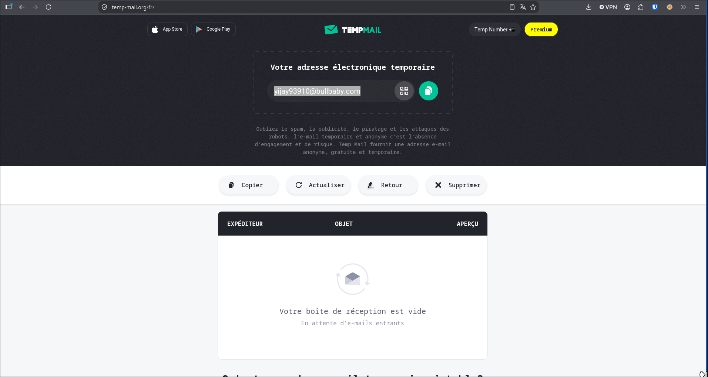
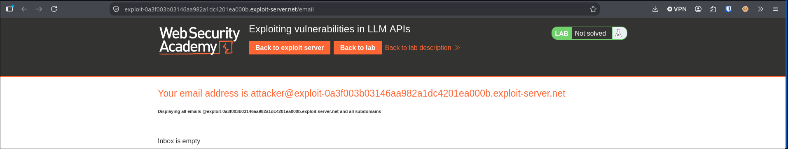
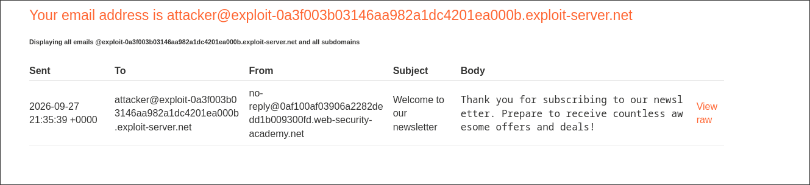
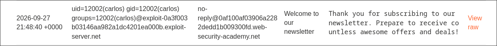
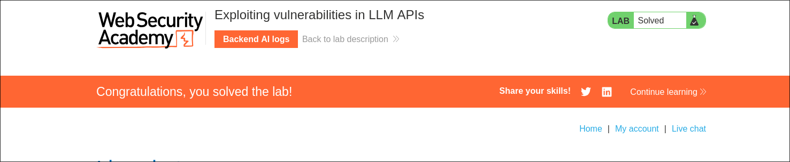

> target : PortSwigger lab "Exploiting vulnerabilities in LLM APIs".
> goal : delete `/home/carlos/morale.txt`.
> path : the shop assistant can call a newsletter API that shoves the email argument into a shell command, so `$(...)` in the email turns into RCE as carlos.

## Mapping the APIs

First i ask the assistant which APIs it has and what arguments each one takes, to map the attack surface. Three of them: password reset, newsletter subscription, product info. The password reset needs an account i don't have, so the newsletter is the comfy first target. And to nuke a file i'm going to want code execution, which is exactly the kind of thing a mail-sending backend tends to hand you.

## Does the assistant actually hit the API?

Before getting fancy, let's check the assistant really reaches the backend. Old reflex, i grabbed a throwaway inbox first:

Then i clocked that the lab already gives you an email client on the exploit server, which is where confirmations land:

So i ask it to subscribe `attacker@YOUR-EXPLOIT-SERVER.exploit-server.net`, and a confirmation drops right into that client:

Good. My chat message became a real API call, and whatever comes out shows up in the email client. That's all i need.

## Time to try something stinky

The email string is user input that ends up inside whatever command the backend runs to send the mail. So let's smuggle a shell command in with `$(...)`, which the shell runs first and swaps for its output. I subscribe `$(id)@...`:

If it shells out, `id` runs and its output replaces `$(id)` in the recipient. And it does:

The mail landed addressed to `uid=12002(carlos) gid=12002(carlos) groups=12002(carlos)@...`. Confirmed OS command injection, and we're running as carlos. Nice bonus: since the command output becomes the recipient, i can read the stdout of a blind RCE straight from the email client.

## Where are we?

Need to know where i'm standing before deleting anything, so `$(pwd)@...`:

Comes back addressed to `/home/carlos@...`, so we're already sitting in carlos' home, right where morale.txt lives 👀

## Delete that thing

pwd is already `/home/carlos`, so a relative path does the job. I subscribe `$(rm morale.txt)@...`:

The assistant whines that the email is invalid, which actually tracks: `rm` prints nothing, so the local part is empty and the address is junk. But the command already ran before the address got validated, and the solved banner pops. we did it.

## What i take from it

The assistant did nothing wrong, it just passed my argument along to the newsletter API. The real bug is downstream: that API builds a shell command out of the email string, so plain old `$(...)` command injection lands. The LLM was just a tunnel to a command injection i couldn't reach directly.

The handy part is that each command's output comes back as the recipient address, so `$(id)` and `$(pwd)` let me read the box even though the RCE gives nothing back directly. Once pwd showed `/home/carlos`, deleting the file was one relative `rm`.

Two labs, same surface, different lessons. Excessive agency was a tool that should never have existed (raw SQL). This one is a legit tool with a busted implementation (shell injection). Same fix direction either way: whatever the model can call has to be safe on its own, because it will get called.
